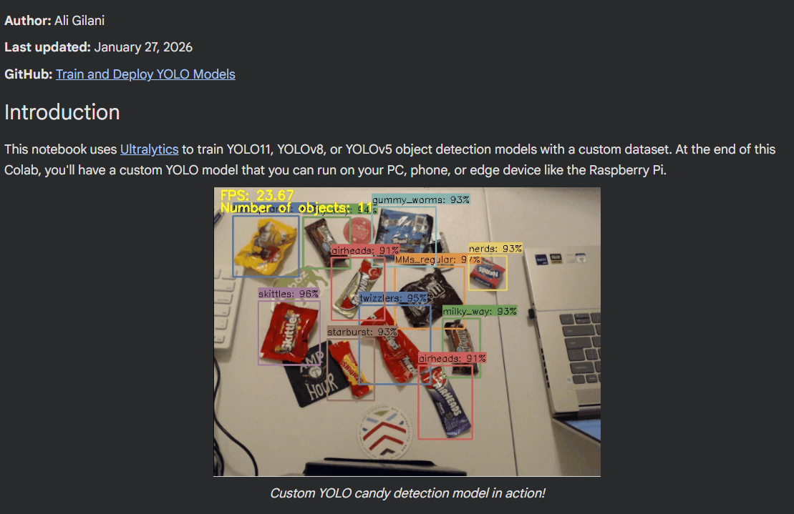

 · [Open in Colab (Train_YOLO_Models.ipynb)](https://colab.research.google.com/github/SyedAliRazaGilani/Train-and-Deploy-YOLO-Models/blob/main/Train_YOLO_Models.ipynb)

### Training a custom YOLO model for candy detection (and sorting by type)

The step-by-step notebook is **[Train_YOLO_Models.ipynb](https://colab.research.google.com/github/SyedAliRazaGilani/Train-and-Deploy-YOLO-Models/blob/main/Train_YOLO_Models.ipynb)** ([open in Colab](https://colab.research.google.com/github/SyedAliRazaGilani/Train-and-Deploy-YOLO-Models/blob/main/Train_YOLO_Models.ipynb#scrollTo=1sUfcA8ZgR2t)). It uses [Ultralytics](https://docs.ultralytics.com/) so you can train **YOLO11**, **YOLOv8**, or **YOLOv5** on your own images, then run the exported model on a PC, phone, or edge device like a Raspberry Pi.

**Google Colab** gives you a Linux machine in the browser with Python already set up. Turn on a **GPU** under *Runtime → Change runtime type*, then run each code cell with the Play button. The notebook’s table of contents (left sidebar) jumps between sections.

For **candy**, you define one **class** per type you care about (for example Skittles vs. Snickers). The model draws a box and a class name on each piece. Your app can then **count**, **group**, or **sort** results by that label—same idea as tallying or separating piles by brand.

**Photos and labels.** A practical first dataset is on the order of **~200** images. Include mixed **backgrounds and lighting**, and some **random objects** in frame—not only candy on a blank desk—so the model generalizes. Label every candy instance in **YOLO format**. [Label Studio](https://labelstud.io/) is a solid free option; export so you have an **`images`** folder, a **`labels`** folder, and a **`classes.txt`** file listing class names. Zip that layout as **`data.zip`**, matching the structure shown in the notebook. If you only want to test the pipeline first, the notebook includes a **sample candy dataset** you can download instead of building your own.

**Getting data into Colab.** You can upload **`data.zip`** from the Files panel, or copy it from **Google Drive** if the zip is large (over ~50 MB, Drive is usually easier). Unzip into a folder (the notebook uses something like `custom_data`), then run this repo’s **[`utils/train_val_split.py`](utils/train_val_split.py)** to put about **90%** of images in **train** and **10%** in **validation**, in the layout Ultralytics expects (`train` / `validation`, each with `images` and `labels`).

**Config and training.** The notebook builds a **`data.yaml`** file from **`classes.txt`** so paths and class names match your folders. Install Ultralytics with `pip install ultralytics`, then start training. **Model size** (`yolo11n` … `yolo11xl`): bigger models are often more accurate but slower; **`yolo11s.pt`** is a reasonable default. **Epochs:** for fewer than ~200 images, **~60** epochs is a sensible starting point; for more images, try fewer (for example ~40). **Image size** **`imgsz`** is often **640**; smaller sizes can run faster if you need speed. You can swap **`yolo11`** for **`yolov8`** or **`yolov5`** in the train command if you prefer those families.

**When training finishes**, let it run to completion—the notebook notes that a final optimizer step matters. The best weights are saved as something like **`runs/detect/train/weights/best.pt`**, with charts and logs beside them. You can run **predict** on your validation images inside Colab to spot-check boxes, then zip the model and download it.

**On your machine**, use **`yolo_detect.py`** from this repo for webcam or files, or the **[candy calorie counter](examples/candy_calorie_counter)** example to map each detected class to calories and sugar—another way to use per-class “sorted” results.

## YOLO Application Examples

This folder contains example code showing different applications you can build around YOLO models.

### Candy Calorie Counter

The [candy_calorie_counter](examples/candy_calorie_counter) example uses a custom YOLO model that's trained to identify popular types of candy (Skittles, Snickers, etc). When candy is placed in front of the camera, the application checks the number of calories and grams of sugar contained in each piece of candy, and it reports the total calories and sugar. It's a basic example of how to use detected object classes to look up information about each object.

### Using YOLO With Multiple Cameras

The [multi_camera](examples/multi_camera) example shows an efficient way to run YOLO models on multiple camera streams using Python multiprocessing.

### Toggle Raspberry Pi GPIO - Smart Lamp

The [toggle_pi_gpio](examples/toggle_pi_gpio) example shows how to set up a "smart lamp" that turns on when a person is detected within a certain area of the camera's view. This example is a useful starting point to see how to toggle the Raspberry Pi's General-Purpose Input/Output (GPIO) pins using YOLO and Python. It also shows how to work with detected object coordinates and make decisions based on where an object is located on the screen.
