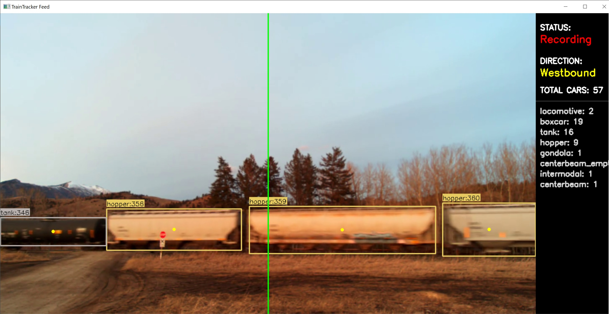

# TrainTracker Example for Jetson Orin Nano
This program uses a custom YOLO detection model to continuously watch for passing trains. When a train passes, it counts the number and type of each car in the train, and then sends an email with information about the train. It also records a video of the train and saves it on disk.

  

